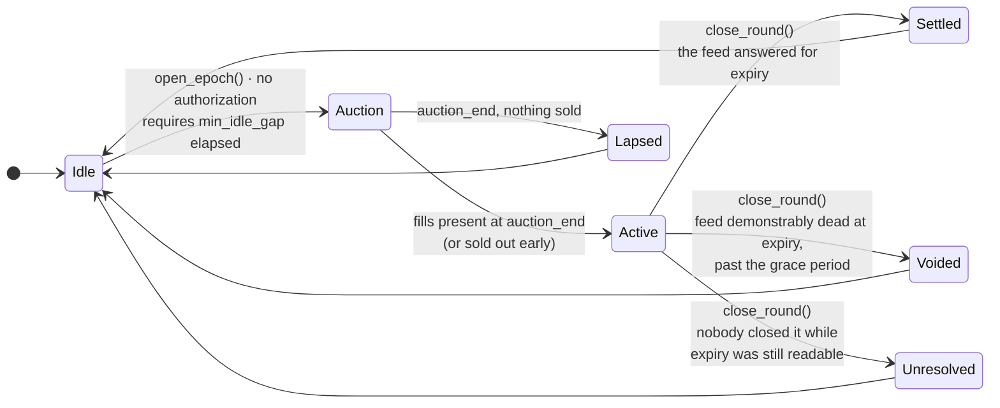
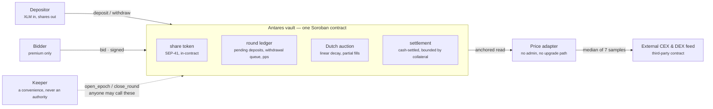

<div align="center">


# Antares

**Covered call vaults on Stellar.**
Deposit XLM, an on-chain auction discovers what an option over it is worth, and the premium goes to the depositors.

[](https://docsantares.vercel.app/)
[](#where-this-stands)
[](#whats-deployed)
[](#honest-limitations)
[](#testing)
[](LICENSE)

<!-- Replace this line with the live URL once the app is deployed:
     **[Open the app](https://…)** · **[Docs](https://docsantares.vercel.app/)** · **[Report a vulnerability](SECURITY.md)** -->

**Live app** *(not deployed yet)* · **[Docs](https://docsantares.vercel.app/)** · **[Report a vulnerability](SECURITY.md)**

</div>

---

Antares writes a covered call against a pool of XLM once per round and sells it in a **descending-price
auction that anyone can bid into**. The premium the auction discovers is credited to depositors
whatever the option does next. There is no quote engine, no privileged pricer, and no operator in the
exit path: opening a round and closing one take no authorization at all, the caller of `close_round`
cannot choose how the round ends, and pause can stop new risk entering but can never trap what is
already inside.

It is **pre-alpha, on testnet, and unaudited.** What separates this codebase from a mainnet
deployment is an audit and a proven counterparty — not a rewrite. [Where this stands](#where-this-stands).

<!-- ────────────────────────────────────────────────────────────────────────────────────────────
     Screenshots. Drop the three files into docs/screenshots/ (see that folder's README for what
     each should show), then delete this comment and the two lines around the table.
     ────────────────────────────────────────────────────────────────────────────────────────────

<table>
  <tr>
    <td width="33%"></td>
    <td width="33%"></td>
    <td width="33%"></td>
  </tr>
  <tr>
    <td align="center"><sub>A round in flight</sub></td>
    <td align="center"><sub>Every round, and how it ended</sub></td>
    <td align="center"><sub>Your position, and what you can claim</sub></td>
  </tr>
</table>

     ──────────────────────────────────────────────────────────────────────────────────────────── -->

---

## Contents

[What it does](#what-it-does) · [How a round works](#how-a-round-works) · [Architecture](#architecture) ·
[What makes it different](#what-makes-it-different) · [What's deployed](#whats-deployed) ·
[Honest limitations](#honest-limitations) · [Where this stands](#where-this-stands) ·
[Repository](#repository) · [Building](#building) · [Testing](#testing) · [Documentation](#documentation)

---

## What it does

For readers who do not trade options:

1. You deposit XLM and receive **share tokens** representing your slice of the pool.
2. Each round the vault sells a **call option** over that XLM — the right, not the obligation, for a
   buyer to take the upside above a fixed **strike** on a set date.
3. The buyer pays a **premium** up front. It goes into the pool, for the depositors, and it is theirs
   whatever happens next.
4. At expiry:
   - **below the strike** → the option expires worthless; the pool keeps the collateral *and* the premium;
   - **above the strike** → the pool pays the difference out of its own collateral, in XLM, and the
     depositors still keep the premium.

The trade is symmetric and it is stated as such: **you earn a premium every round, and in exchange you
give up the part of a rally that goes past the strike.** In coins, not in percentages — the
[depositor's page](https://docsantares.vercel.app/depositor/what-you-give-up/) puts a table on it.
**There is no APY on this repository, in the interface, or anywhere else.** 


## How a round works

One round is in flight at a time. Three phases, four ways out, and two calls that anyone at all can make.



**All four outcomes are normal**, and two of them produce no premium and no payout at all. An auction
that clears empty is a data point about demand, not a failure to hide; a round annulled by a dead feed
costs depositors nothing and refunds every bidder exactly.

**One entry point closes a round and its caller does not choose the outcome.** `close_round()` reads
the price as it stood *at expiry*, once, and dispatches on what it finds. Calling early or late returns
the same number. Three separate entry points would let the caller name the result; one dispatcher makes
the exclusion structural.

At the shipped parameters — a 3-day round, struck 3 % out of the money, a 45-minute auction decaying
from 2.80 % to 0.55 % of notional — a round reaches a terminal state within **21 hours past expiry**
whatever the price feed is doing, on a branch that calls no external contract at all.

→ [The four ways a round ends](https://docsantares.vercel.app/mechanism/round-outcomes/)

## Architecture



Single contract: vault, token, auction and settlement share one state, so no path costs a
cross-contract hop. The keeper is a bot on a timer holding one key that can call two entry points
**anyone** can call — losing it costs the bounties and nothing else.

→ [Contract surface](https://docsantares.vercel.app/reference/contract-surface/) — 42 exported
functions, 36 events, every error code

## What makes it different

Four claims, each one a property of the deployed code rather than a promise:

| | |
|---|---|
| **The exit cannot be closed** | Pause blocks exactly three calls — `deposit`, `bid`, `open_epoch` — and all three are ways *in*. Nine calls, including every way of getting paid, work in every state where they would work unpaused. No pause timeout is needed, because pause cannot hold anything hostage |
| **Nobody names the outcome** | Not the admin, not the keeper, not the bidder, not you. The price is read as it stood at expiry and the branch is selected by what that read returns |
| **The payout is bounded by the collateral** | `payout = ⌊notional × (spot − strike) ÷ spot⌋`, and that fraction is under 1 for every positive strike. No leverage, no margin call, no bad debt — as arithmetic, not as a risk parameter |
| **A dead operator cannot strand your money** | Opening and closing are permissionless and closing pays its caller a bounty. Past a bound validated on-chain, a round finalizes **without calling the price adapter at all** |

The price feed is pinned at construction and has **no setter in the contract**; the adapter that reads
it has **no admin and no upgrade path of its own**.

## The admin, and what it cannot do

There **is** an admin — one address, a single key held by this project on testnet. Hiding it would be
the opposite of the point, so here is the whole surface.

| It can | It cannot — and this is the absence of a code path, not a policy |
|---|---|
| Pause `deposit`, `bid`, `open_epoch` | Move, borrow or redirect user funds |
| Set the deposit cap | Mint shares, or change anyone's balance |
| Set the fee — **0 at genesis**, capped at 20 % *of the premium*, never of capital | Alter a finalized round: no past settlement, price or claim can be rewritten |
| Set the fee recipient | Choose the settlement price, or which way a round ends |
| Set the round parameters — **next round only**, never the live one | Block the exit path: nine calls work while paused, including every way of getting paid |
| Toggle the bidder allowlist — **only until it expires** | Extend that expiry. It is fixed at construction and has no setter |
| Adjust storage rent thresholds | **Change the oracle or the asset.** Neither has a setter in the contract at all |
| Hand the role on, via a **two-step** transfer the new address must accept | Take the role back, or brick it with a typo — that is what two steps are for |
| Replace the contract code — `upgrade()` | — |

**The fee is 0 because no transaction ever set it**, not because a deploy argument happened to be
zero — so any non-zero fee leaves a public transaction behind and you do not have to take our word
for the zero.

**`upgrade()` is the one real trust concentration**, and it was chosen over immutability deliberately:
this code is unaudited, and immutability before an audit is an unfixable bug waiting to happen. Before
any mainnet deployment the admin becomes a **timelocked multisig whose delay exceeds
`epoch_duration + unresolved_after`** — 7 days 21 hours at the mainnet-target configuration — so a user
can always exit at the old code before new code takes effect. Operational rule: never upgrade while a
round is live; the contract permits it and the deployment tooling refuses it.

→ [Who can do what to your funds](https://docsantares.vercel.app/trust/trust-model/) — every
power in the system and who holds it, including the ones we would rather did not exist

## What's deployed

Stellar **testnet**, one vault. Every address links to an explorer; every wasm hash can be reproduced
by building this repository at the commit named.

| | Address | Wasm SHA-256 |
|---|---|---|
| **Vault** (`aXLM-E`, 3-day, 3 % OTM) | [`CCYAHS4D…LBVEA`](https://stellar.expert/explorer/testnet/contract/CCYAHS4DJLGNDU7GTSDUJL4ZZ2X6VZI7IPHJM2W2SNVA6RDALEALBVEA) | `7b5f098bddd47b4b9cf8ff22b75a0ead4c41ccd741c61c8ac3dabb579a4a80f2` |
| **Price adapter** (what the vault reads) | [`CBR3GSAZ…BCEN5Z`](https://stellar.expert/explorer/testnet/contract/CBR3GSAZUOFGWP5IUSIJP5ESUZPDIO42WAZ5VIFSNYZURH2VVSBCEN5Z) | `d88120b0da3250edea169996ce1840c9138a8c72c2866e846173d0d92f33242d` |
| CEX & DEX XLM/USD feed (third-party) | [`CCYOZJCO…MJRN63`](https://stellar.expert/explorer/testnet/contract/CCYOZJCOPG34LLQQ7N24YXBM7LL62R7ONMZ3G6WZAAYPB5OYKOMJRN63) | — |
| XLM, native Stellar Asset Contract | [`CDLZFC3S…HHGCYSC`](https://stellar.expert/explorer/testnet/contract/CDLZFC3SYJYDZT7K67VZ75HPJVIEUVNIXF47ZG2FB2RMQQVU2HHGCYSC) | — |

Deployed 2026-08-24T09:11:48Z by `antares-testnet`
([`GDFPSLES…EKBQQ`](https://stellar.expert/explorer/testnet/account/GDFPSLESDEPR2XSNASBK3464NLB7HYG6IS2SX2TYCJK7KUPIEWFEKBQQ)),
from a **clean tree** at commit `87e4224a` — a deploy from a dirty tree is refused before anything is
submitted, because a commit id identifies the code that ran only if the tree was clean.

The full record — constructor arguments, all sixteen round parameters, the toolchain and the build host
— is in [`deployments/testnet.json`](deployments/testnet.json), written by the deploy script as it
submits rather than by hand.

<details>
<summary><b>Reproducing the hashes</b> — and the one caveat that is ours rather than yours</summary>

<br>

Build at commit `87e4224a` and compare; `stellar contract fetch --id <address> --network testnet`
returns the deployed bytes.

**The hash reproduces against a host, not against a toolchain.** Measured 2026-08-21:
`aarch64-apple-darwin` and `x86_64-unknown-linux-gnu` build the vault to the same **65 374 bytes** and
two different SHA-256s. Section by section they agree everywhere it is possible to disagree about
meaning — `import`, `export`, `data` and all four custom sections including `contractspecv0` are
byte-identical, and `stellar contract info interface` returns the same **42 functions** — while `type`,
`function` and `code` differ at identical sizes, because the type table is emitted in a different order
and every index into it follows. Same program, different internal numbering.

**Both deployments above were built on `aarch64-apple-darwin`**, and they predate the field that records
it. That host is stated here from the machine that ran the deploy rather than read back out of the
record, and that gap is exactly what `toolchain.buildHost` closes from 2026-08-21 onward. It is named
here rather than backfilled, because a record of what happened is worth less once it is edited after
the fact.

CI's reproducible-build job proves a narrower property than its name suggests: it builds twice on one
runner at deliberately different path lengths, which shows the output does not depend on where the
source sits, and says nothing about which machine compiled it.

</details>

## Where this stands

The contract is **written, tested and deployed**. Two things stand between it and a mainnet
deployment, and neither is written in Rust:

- **An audit.** No external party has reviewed this code.
- **A counterparty.** Whether an independent bidder will pay a premium, and at what price. It is
  answered by three conditions together, all counted **within a single vault**: at least 3 addresses
  outside this project fill; at least 4 consecutive rounds with a fill; notional-weighted average
  clearing at or above `max(0.75 × Black-Scholes fair value at the volatility the round realized, 1.30 × the auction's reserve)`.

### The stop condition

Every gate above is a *go* gate. Here is the one that ends the project:

> **If 8 consecutive rounds *and* at least 30 calendar days pass with the bidder allowlist disabled and
> no independent fill, development stops.**

Both conditions are required because an empty round ends in 45 minutes, not a week — with the mandatory
gap counted, a full empty cycle takes as little as **2 h 45 min**, so eight could otherwise elapse in
about 22 hours against evidence gathered while no counterparty was awake.

The allowlist that gates bidding **expires on a timestamp fixed at deployment**, capped at 30 days, with
no setter that can extend it: the one gate that can end this project cannot be frozen by leaving a
launch control switched on. If it triggers, we publish what happened — how many rounds, at what
parameters, what premiums were on offer, how many counterparties were approached and what they said —
and then choose, publicly: pivot, park the code, or close.

**A project without a stop condition cannot tell you it was wrong.**

## Repository

```
contracts/      Soroban contracts (Rust): vault, price adapter, mock price source
deployments/    Committed record per network: contract ids, wasm hashes, constructor args
packages/       Shared TypeScript (network config, generated bindings)
reference/      Python differential reference for the settlement math, written from the spec
keeper/         Off-chain round trigger (TypeScript) — convenience, never authority
bidder/         Open-source reference bidder (TypeScript)
web/            Landing page and the app (Next.js)
site/           This project's documentation site (Astro + Starlight)
scripts/        Network-parameterised deployment, verification and profiling tooling
docs/           Architecture, invariants, trust model, runbook
```

## Building

Every version is pinned exactly, never by range or channel.

| | Pinned at |
|---|---|
| Rust | `1.95.0` — in `rust-toolchain.toml`, by exact version rather than `stable` |
| Build target | `wasm32v1-none` |
| `soroban-sdk` | `=27.0.6` |
| `stellar-cli` | `27.1.0` |
| Node / pnpm | 22 / 11 |

```bash
cargo test --workspace                    # unit + property
stellar contract build --out-dir out      # deployable wasm, all three contracts
python3 scripts/ci/static_rules.py        # every source rule a grep can decide
```

The documentation site is its own project rather than a workspace member — it pins Astro against a
toolchain the contracts must never see:

```bash
cd site && pnpm install --ignore-workspace && pnpm dev
```

The pins are not tidiness. The goal is that the binary deployed to mainnet is **byte-identical** to the
one that ran on testnet and was audited — an audit certifies a binary, not an intention, and a build
that cannot be reproduced turns every invariant back into something asserted only by our own tests.

**The contracts contain no network flags** — no feature gates, no conditional compilation, no network
names in the source. Everything that differs between testnet and mainnet is a constructor argument, and
a static check refuses any that appear.

## Testing

```
cargo test --workspace     361 passed, 0 failed
```

| Layer | Covers |
|---|---|
| **Unit** | Every state transition, including every rejected one. Each guard has a test that proves it rejects |
| **Property** | Settlement math and round accounting over arbitrary inputs: I1–I10 hold, `payout ∈ [0, notional_sold)`, `pps ≥ 0` — asserted after every single transition, and guarded against being vacuous |
| **Fuzz** | Call-sequence, auction and settlement-math targets in adversarial orderings. Every ordering is repeated under `paused == true` to prove the exit path |
| **Differential** | Curve, settlement and claim output replayed against an independent Python reference written from the spec, not from the Rust |
| **Static rules** | Eleven source rules a grep can decide — ABI doc budget, network-agnostic build, no value in temporary storage, every outbound call declared and recoverable |

→ [The ten invariants](https://docsantares.vercel.app/trust/invariants/), what each says and how each is verified

## Documentation

### <https://docsantares.vercel.app>

Written for whoever arrived from a link; `docs/` in this repository is written for whoever has the
tree open. The site's source lives on the `docs-site` branch under `site/`, and the published
output is served from [`AntaresDocs`](https://github.com/tamerrarda/AntaresDocs).

| Start with | If you are |
|---|---|
| [What a covered call is](https://docsantares.vercel.app/start/covered-call/) | New to options |
| [Depositing](https://docsantares.vercel.app/depositor/depositing/) | Considering depositing XLM |
| [What you are buying](https://docsantares.vercel.app/bidder/what-you-are-buying/) | A potential counterparty |
| [Who can do what to your funds](https://docsantares.vercel.app/trust/trust-model/) | Deciding whether to trust this |
| [Contract surface](https://docsantares.vercel.app/reference/contract-surface/) | Integrating or reviewing the code |

## License

Apache-2.0 — see [`LICENSE`](LICENSE).

