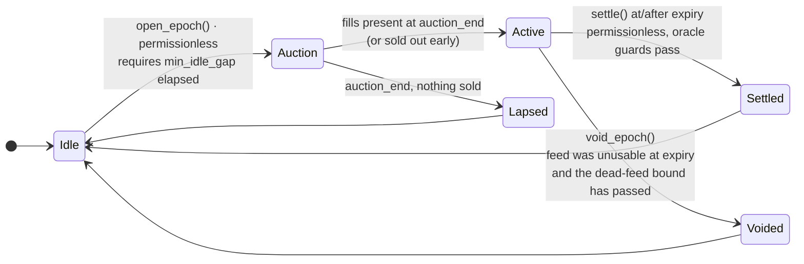
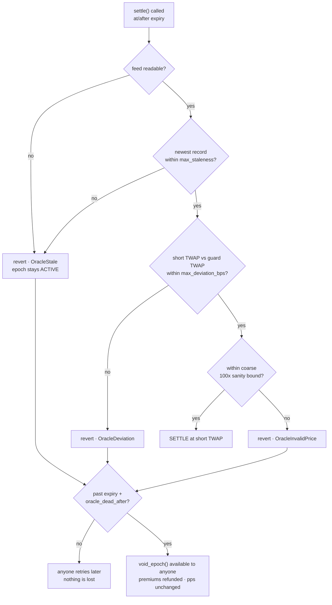

# Antares — Architecture

> Part of the [documentation set](README.md). This document is the system design. The properties it must uphold live in [INVARIANTS.md](INVARIANTS.md); who holds which powers lives in [TRUST_MODEL.md](TRUST_MODEL.md). Each fact has one home — the others link to it rather than restating it.

**Design principle:** every decision in this document is the decision we would make if this contract held real value tomorrow. Testnet is a network parameter. Nothing here is a shortcut to be replaced later; the gap between this design and a mainnet deployment is an audit and a proven counterparty, not a rewrite.
---

## 1. Standards alignment

| Question | Decision | Reasoning |
|---|---|---|
| Share token interface | **SEP-41 (token interface), implemented inside the vault contract** | Wallets, explorers and DEXes can read the share token like any other Soroban token. A separate token contract would add a cross-contract hop on every mint/burn for no benefit. |
| Vault standard (SEP-56 / ERC-4626-style, incl. OpenZeppelin's Soroban vault extension) | **Follow where it does not conflict; do not inherit the accounting** | 4626-style vaults assume deposit and redeem are continuous and instant. A covered-call vault locks collateral for the duration of an epoch — capital arriving mid-epoch cannot be allowed to dilute the premium earned by capital that was actually at risk. This is the same reason Ribbon built custom round-based accounting rather than using 4626 directly. We expose 4626-shaped views (`total_assets`, `convert_to_shares`) for tooling, but issuance is epoch-gated. |

**Consequence:** the epoch ledger in §4 is written by us and is the highest-risk component in the codebase. It gets the deepest test coverage (§11).

---

## 2. Contract surface

Single contract. Module boundaries live in the code (`vault`, `auction`, `settle`, `oracle`, `admin`), not at addresses.

### Lifecycle

```rust
fn __constructor(env: Env, admin: Address, asset: Address, oracle: Address, fee_recipient: Address, params: EpochParams);

fn open_epoch(env: Env) -> bool;         // permissionless; false = nothing to open yet (any pending finalization still persists)
fn bid(env: Env, bidder: Address, notional: i128, max_premium_bps: u32) -> i128;  // permissionless
fn settle(env: Env, bounty_to: Address); // permissionless; pays the caller a small bounty
fn void_epoch(env: Env, bounty_to: Address);  // permissionless; only when the feed was unusable AROUND EXPIRY and the dead-feed bound has passed (§7)
```

### Depositor

```rust
fn deposit(env: Env, from: Address, amount: i128);
fn cancel_pending_deposit(env: Env, from: Address) -> i128;   // only funds never locked
fn redeem_shares(env: Env, from: Address) -> i128;            // pending deposit -> shares; Idle only (§4)
fn request_withdraw(env: Env, from: Address, shares: i128, require_idle: bool);  // guard against a phase race
fn claim_withdraw(env: Env, from: Address) -> i128;
fn restore_position(env: Env, user: Address);                 // archival recovery; callable by anyone
```

### Bidder (pull-based — settle/void never iterate bidders)

```rust
fn claim_payout(env: Env, round: u32, bidder: Address) -> i128;  // after a Settled round, spot > strike
fn claim_refund(env: Env, round: u32, bidder: Address) -> i128;  // after a Voided round
fn claim_fee(env: Env) -> i128;                                  // fee_recipient pulls accrued fee
```

### Admin

```rust
fn set_paused(env: Env, paused: bool);
fn set_deposit_cap(env: Env, cap: i128);
fn set_fee_bps(env: Env, bps: u32);          // ships at 0
fn set_epoch_params(env: Env, params: EpochParams);   // takes effect next epoch only
fn set_allowlist_enabled(env: Env, enabled: bool);
fn set_allowed(env: Env, bidder: Address, allowed: bool);
fn set_fee_recipient(env: Env, recipient: Address);
fn set_rent_params(env: Env, threshold: u32, extend_to: u32);  // TTL policy in ledgers — tunable because ledger close time is not constant
fn transfer_admin(env: Env, new_admin: Address);      // two-step handover:
fn accept_admin(env: Env);                            // a typo'd address cannot brick the admin role
fn upgrade(env: Env, new_wasm_hash: BytesN<32>);      // upgradeable v1 — see §8
fn migrate(env: Env, to_version: u32);                // monotonic, idempotent
```

Admin can never: move user funds, mint shares, change a settled epoch, or settle at a chosen price. The only emergency lever is **pause**, and pause blocks new deposits, new bids and new epochs — it never blocks the exit path (see [INVARIANTS.md](INVARIANTS.md) I8 for the exact set). A paused contract must still be able to unwind.

### Views + SEP-41

```rust
fn epoch(env: Env) -> EpochInfo;
fn position(env: Env, user: Address) -> Position;
fn price_per_share(env: Env, round: u32) -> i128;
fn total_assets(env: Env) -> i128;
fn convert_to_shares(env: Env, assets: i128) -> i128;

fn config(env: Env) -> ConfigView;
fn bidder_position(env: Env, round: u32, bidder: Address) -> BidderPosition;

// SEP-41: balance, transfer, transfer_from, approve, allowance, burn, burn_from, decimals, name, symbol
```

---

## 3. Storage model

Amounts are `i128` in stroops (7 decimals). Ratios are basis points (`u32`, 10 000 = 100 %). `PRECISION = 1e7` for price-per-share.

| Type | Key | Value | TTL policy |
|---|---|---|---|
| **instance** | `Config` | admin, pending_admin, asset, oracle, fee_recipient, fee_bps, deposit_cap, paused, allowlist_enabled, params, rent params | bumped on every write |
| **instance** | `State` | round, phase, strike, expiry, notional_offered, notional_sold, premium_collected, locked_assets | bumped on every write |
| **instance** | `AppVersion` | `u32` — migration schema version (§8) | bumped on every write |
| **persistent** | `Shares(Address)` | `i128` | bumped on touch |
| **persistent** | `Allowance(Address, Address)` | SEP-41 allowance `(owner, spender)` with `live_until_ledger` | bumped on touch |
| **persistent** | `PendingDeposit(Address)` | `{ round: u32, amount: i128 }` | bumped on touch |
| **persistent** | `PendingWithdraw(Address)` | `{ round: u32, shares: i128 }` | bumped on touch; **also bumps `Round(round)`** |
| **persistent** | `Round(u32)` | `{ outcome, pps, strike, expiry, notional_sold, premium, fee, settled_spot, payout_total }` | bumped while any pending withdrawal or fill references it |
| **persistent** | `Fill(u32, Address)` | `{ notional, premium_paid, claimed }` — per (round, bidder); basis for pull-based `claim_payout`/`claim_refund` | bumped on touch; **also bumps `Round(round)`** |
| **persistent** | `Allowed(Address)` | `bool` | bumped on touch |
| **temporary** | — | **nothing** | no value-bearing state is temporary, ever |

**Archival:** a `Round` record may only be allowed to expire once no `PendingWithdraw` references it. A public `restore_position(user)` path is documented so a returning depositor with an archived entry has a deterministic recovery route rather than a support ticket.

---

## 4. Epoch lifecycle and share accounting

This diagram is canonical — every other description of the lifecycle in this repository defers to it.



Three terminal outcomes, one shared exit: settle, lapse and void all finalize through the same internal path, so the withdrawal-queue accounting cannot diverge between them.

| Outcome | Reached when | Premium | Payout | `pps` | Collateral |
|---|---|---|---|---|---|
| **Settled** | expiry reached, oracle usable | kept by depositors | to bidders if `spot > strike` | recomputed | reduced by payout + fee |
| **Lapsed** | auction closed with no fills | none earned | none | unchanged | untouched |
| **Voided** | feed unusable past `expiry + oracle_dead_after` | refunded to bidders | none | unchanged | untouched |

`LAPSED` and `VOIDED` are **normal terminal states, not errors.** An auction that clears empty is a data point about demand; an annulled round is what a dead oracle costs, which is nothing to depositors and nothing to bidders. Both are recorded, both emit events, and the next epoch may open immediately after either.

### Why deposits are epoch-gated

Capital that arrives while an option is live took none of that option's risk. If it minted shares immediately it would claim a share of a premium it did not earn, and dilute the depositors who did. So:

- **Deposit during round R** → `PendingDeposit { round: R, amount }`. The XLM is held by the contract but is **not** part of `locked_assets`, and the vault may not write calls against it.
- **After round R settles** → the pending deposit converts to shares **at the current price when it converts**, not at a price frozen when it was deposited. Capital that sat pending took none of the intervening rounds' risk, so it enters at today's price; this also makes converting and cancel-then-redeposit worth exactly the same, which is why cancellation stays open for a pending deposit's whole life.
- **Deposit while no round is live (`IDLE`)** → mints instantly at the last settled `pps` (auto-redeeming any older finalized pending first). No option is live, so instant minting dilutes nobody.
- **`cancel_pending_deposit`** returns funds that were never locked. This is the only instant exit and it is safe precisely because that capital never backed an option.

**Share mints happen only while the phase is `IDLE`.** A share minted mid-round at an old `pps` would acquire a claim on the live round's P&L that its capital never backed — if `pps` rises, total claims exceed the pool and solvency (I1) breaks. Burns (`request_withdraw`) are safe in any phase: burned shares stay in the round's `pps` denominator snapshot, so the exiting holder gets exactly this round's price. To guarantee a usable mint/redeem window every cycle, `open_epoch` requires `now ≥ last_finalize_time + min_idle_gap` (an `EpochParams` field).

### Withdrawals

- **`request_withdraw(shares)` during round R** → shares are burned, `PendingWithdraw { round: R, shares }` is recorded.
- **After round R settles** → `claimable = shares × pps[R] / PRECISION`.
- **`request_withdraw` while no round is live** (phase `IDLE`) → converts at the last settled `pps` and is claimable immediately. No option is live, so nothing is at risk and there is nothing to wait for.
- **`claim_withdraw`** transfers. There is no path that pays out an unsettled round.

### Settlement accounting

At `settle()` for round R:

```
fee_R      = premium_R × fee_bps / 10_000
assets_R   = locked_assets + premium_R − payout_R − fee_R
pps[R]     = assets_R × PRECISION / shares_snapshot          (supply at open)
```

`shares_outstanding_R` is the share supply **at the start of round R** — pending deposits from round R are not in it, and shares burned by `request_withdraw` during round R are. Both are deliberate: the first has not earned yet, the second is exiting at this round's price.

---

## 5. Dutch auction

The premium is discovered, not assumed. A descending-price auction is the only mechanism that prices an option on Stellar today without a volatility oracle — and Stellar has no reliable volatility feed.

**On `open_epoch()`:**

```
spot           = oracle_guarded_reading()   // short TWAP; §7 guards: staleness, self-consistency, sanity
strike         = spot × (10_000 + strike_bps_otm) / 10_000
expiry         = now + params.duration
notional_offer = locked_assets
auction_end    = now + params.auction_duration
```

**Price path** — linear decay in basis points of notional:

```
premium_bps(t) = start_bps − (start_bps − floor_bps) × (t − t0) / auction_duration
```

**On `bid(bidder, notional, max_premium_bps)`:**

1. Reject if `phase != AUCTION`, if past `auction_end`, or if paused.
2. Reject if `allowlist_enabled` and the bidder is not allowed. *(Launch control only — the default path is permissionless.)*
3. Compute `p = premium_bps(now)`. Reject if `p > max_premium_bps` — this is the bidder's slippage guard and it is not optional.
3b. **ITM guard:** reject if the freshest oracle tick shows `spot ≥ strike`, or if that check is unavailable. The strike is fixed while the curve descends; once the option is at/in the money, any fill sells intrinsic value for at most the curve premium — refusing is strictly better, and an empty auction costs depositors nothing. Reject also any fill whose premium rounds to zero.
4. `filled = min(notional, notional_offer − notional_sold)`. **Partial fills are the expected case**, not an exception: in a thin market, all-or-nothing means no fills at all.
5. Transfer `premium = filled × p / 10_000` in XLM from the bidder to the vault.
6. Record the fill against the bidder (needed for the §7 refund path). Increment `notional_sold`, add to `premium_collected`.
7. If `notional_sold == notional_offer`, transition to `ACTIVE` early.

**At `auction_end`:** `notional_sold > 0` → `ACTIVE`. `notional_sold == 0` → `LAPSED`.

Unsold notional stays in the vault, unencumbered, earning nothing that epoch. It is not re-offered mid-epoch — a second offer at a different strike inside one epoch would make the position path-dependent and the accounting far harder to reason about.

**Premium is recognised at fill, never at offer.** Multiple fills at different points on the decay curve produce different premiums, and the ledger must reflect that. Building the accounting around "the premium is known when the epoch opens" is the single easiest way to make this contract unfixable later.

---

## 6. Settlement math

Cash-settled, paid in XLM out of the vault's own collateral.

```
if spot ≤ strike:   payout = 0
else:               payout = notional_sold × (spot − strike) / spot
```

Two properties make this safe by construction:

- **`payout < notional_sold` for all `spot`.** As `spot → ∞`, `(spot − strike)/spot → 1`, so the payout approaches but never reaches the sold notional. The vault can never owe more than the collateral backing the position — no margin call, no bad debt, no liquidation engine.
- **No second leg.** The bidder paid the premium up front and has no further obligation. There is no atomic swap, no delivery failure, no counterparty credit risk, and a bidder never needs to hold `strike × notional` in capital. That last point is the reason the capital barrier to *being* a counterparty is roughly 20× lower here than under physical settlement — which matters more than anything else in a market this thin.

Payout is distributed to bidders pro-rata to their filled notional — **pull-based**, via `claim_payout(round)` computed from each bidder's own `Fill` record. `settle()` and `void_epoch()` are O(1) and never iterate bidders: a per-bidder loop would make the exit path's cost grow with participation, which is a denial-of-service surface. Depositors absorb the payout and receive the premium, both pro-rata to shares, through `pps[R]`.

---

## 7. Oracle safety envelope

Settlement correctness rests entirely on the price feed, so every failure mode gets a defined behaviour and **none of them trap funds.**



Retry on staleness, halt on deviation, void on death — and **every step is permissionless.** The contract never invents a price: no fallback settles on a fabricated or clamped value, because a wrong settlement is strictly worse than a refunded one.

| Condition | Behaviour |
|---|---|
| Normal | TWAP over `twap_window`, not a spot tick. A single-block price never decides a settlement. |
| Feed older than `max_staleness` | `settle()` reverts. The epoch stays `ACTIVE` and settlement may be retried by anyone. Nothing is lost; settlement is late. |
| Short TWAP diverges from a longer guard TWAP of the same moment by more than `max_deviation_bps` | `settle()` reverts, same as above. A circuit breaker, not a silent clamp. Comparing two windows of the same moment means the breaker fires on feed artifacts and **never on sustained real market moves** — a cross-epoch comparison would wedge a legitimate settlement into the void path. |
| Feed unusable for longer than `oracle_dead_after` past expiry | **Epoch is voided — by anyone.** `void_epoch()` is permissionless, exactly like `settle()`: a dead oracle plus a dead keeper must still never trap funds. Premium is refunded to bidders pro-rata to their fills, payout is zero, `pps` is unchanged, a loud event is emitted. |

The void-and-refund choice is deliberate: an oracle failure is nobody's fault, so nobody should profit from it. Settling at strike would hand depositors a free premium; paying out on a stale price would hand bidders a lottery ticket. Refunding restores both sides to where they started.

`PriceSource` is an interface with a Reflector implementation and a mock. **Settlement reads the price as it was at expiry**, not at the moment someone calls — so every caller, early or late, computes the same settlement price and timing is worth nothing to anyone. The adapter takes several point samples across each window (`price(asset, timestamp)`, verified against the live contract — the batch call collapses well before the history it would need) and reduces each window to a **median**, which absorbs a single bad print without needing a retry. **Feed selection is part of the security model:** the pinned feed is Reflector's external CEX & DEX XLM/USD feed — deep aggregated off-chain markets — never any feed sourced from a thin on-chain order book. The February 2026 YieldBlox incident on Stellar was a correctly-functioning oracle reading a manipulable on-chain market; the class is excluded here by construction, and the oracle address is immutable after deployment (changing it requires a reviewed upgrade). Adding median-of-N or a secondary feed later (RedStone now ships SEP-40 feeds on Stellar) is a new implementation, never a refactor — that is the fallback *mechanism*; void-and-refund is the fallback *guarantee*.

---

## 8. Admin, pause, upgradeability

- **Admin** is a single address in this design, expected to be a multisig before any mainnet deployment. Its powers are enumerated in §2 and deliberately exclude anything that touches user funds.
- **Pause** blocks `deposit`, `bid` and `open_epoch`. It never blocks `settle`, `void_epoch`, `request_withdraw`, `claim_withdraw`, `claim_payout`, `claim_refund`, `claim_fee`, `cancel_pending_deposit`, `redeem_shares` or `restore_position`. A paused vault therefore unwinds to cash on its own: the epoch in flight settles (or voids) permissionlessly, and every depositor can then exit at the settled `pps`. Pause needs no timeout because it never holds funds hostage — the exit path is unpausable, and its worst-case delay is bounded by the live epoch's `expiry + oracle_dead_after`, after which `void_epoch()` is open to anyone.
- **Deposit cap** ships enforced. A first live vault launches capped; the parameter exists from day one so that turning it on is not a code change.
- **Fee** ships at 0 bps, but the parameter and its place in the settlement formula exist from day one — retrofitting a fee into share math changes `pps` for every historical round.
- **Upgradeability — resolved: upgradeable v1.** Admin-gated `upgrade(new_wasm_hash)` (SEP-49 style: `contractmeta` binary version, `AppVersion` in storage, monotonic idempotent `migrate()`). This is the protocol's one real trust concentration and it is disclosed as such: testnet runs a single documented admin address; **before mainnet the admin becomes a timelocked multisig whose delay exceeds a full epoch plus `oracle_dead_after`**, so users can always exit at the old code before new code takes effect. Operational policy: never upgrade while a round is live (scripts enforce Idle).

---

## 9. Invariants

**[INVARIANTS.md](INVARIANTS.md) is the canonical definition** — it states each invariant
precisely, explains what breaks without it, and names how it is verified. Summarized here only
so this document reads end to end:

| | In one line |
|---|---|
| **I1** | Solvency: the contract holds at least everything it has promised — collateral, pending deposits, claimable withdrawals, claimable bidder balances, accrued fee |
| **I2** | Nothing is sold that isn't backed: `notional_sold ≤ notional_offered ≤ locked_at_open` |
| **I3** | `payout < notional_sold` for every possible price — no margin calls, no bad debt |
| **I4** | Locked collateral cannot leave during a live round; pending deposits remain cancellable |
| **I5** | Share supply is exact: `Σ balances == shares_outstanding` |
| **I6** | Every finalized round has `pps > 0` |
| **I7** | Round records are immutable once written |
| **I8** | The exit path cannot be paused |
| **I9** | Instant withdrawals between rounds are always fully covered |

---

## 10. Events

Every state transition emits. The off-chain metric collector and the public dashboard read only events; no indexer needs to reconstruct state from storage.

```
deposited{user, round, amount}
pending_redeemed{user, round, shares, pps}
withdraw_requested{user, round, shares}
withdraw_claimed{user, round, amount}
payout_claimed{round, bidder, amount} · refund_claimed{round, bidder, amount}
fee_accrued{round, amount} · fee_claimed{recipient, amount} · settle_bounty{round, to, amount} · position_restored{user}
upgraded{old_version, new_version} · migrated{version}

epoch_opened{round, strike, expiry, notional_offered, twap}
bid_filled{round, bidder, notional, premium_bps, premium}
epoch_lapsed{round}
settled{round, spot, payout, premium, fee, pps}
epoch_voided{round, reason}

paused{by} · unpaused{by} · params_changed{...} · admin_changed{old, new}
```

`epoch_lapsed` and `epoch_voided` are deliberately first-class. An auction that clears empty is a data point about demand, not a failure to hide.

**Rejected settlements emit nothing**, because in Soroban a reverting invocation discards its events along with its state — an event on a failing path is not implementable. A stale or deviating feed is observed through the error code that simulation returns, which is what the keeper alerts on. The full event ABI, including which fields are topics, is specified in the contract spec.

---

## 11. Test strategy

| Layer | Covers |
|---|---|
| **Unit** | Every state transition, including every rejected one. Each guard has a test that proves it rejects. |
| **Integration** | Full epochs against testnet: open → bid → settle, plus the lapse path and the void path. |
| **Property-based** | Settlement math and epoch accounting. For arbitrary `(spot, strike, notional, deposits, withdrawals)`: I1–I9 hold, `payout ∈ [0, notional_sold)`, `pps > 0`. This is the highest-value suite in the repo because §4 is the highest-risk component. |
| **Fuzz** | Call-sequence fuzzing — deposit/withdraw/bid/settle in adversarial orderings, over-sell attempts, double-settle, settle-before-expiry, bid-after-close. Every ordering is repeated under `paused == true` to prove I8. |
| **Differential** | Settlement output compared against an independent reference implementation written in Python from the spec, not from the Rust. |

Every guard in §7 has a test that forces the condition — stale feeds and deviating prices are simulated through the mock `PriceSource`, not waited for.

---

## 12. Open decisions — all resolved (2026-08-16)

Every decision below was closed **before contract work started**.

1. **Upgradeability — resolved: upgradeable v1.** Admin-gated upgrade with versioned migrate; timelocked multisig before mainnet; trust statement in README and §8.
2. **Dead-oracle policy — resolved: void-and-refund** (§7), confirmed by external review. The refund path doubles as the guaranteed exit when a feed never recovers.
3. **Auction decay curve — resolved: linear.** Exponential's marginal benefit does not justify harder verification; the curve is an internal function, replaceable without touching storage.
4. **Strike selection — resolved: fixed % OTM parameter.** Volatility-adjusted selection requires a volatility source Stellar does not have; the parameter leaves the policy adjustable per epoch.
5. **Multisig threshold and signers — resolved as a mainnet gate.** Testnet runs a single documented admin; threshold and signer set are chosen at the mainnet gate, blocking nothing before it.
