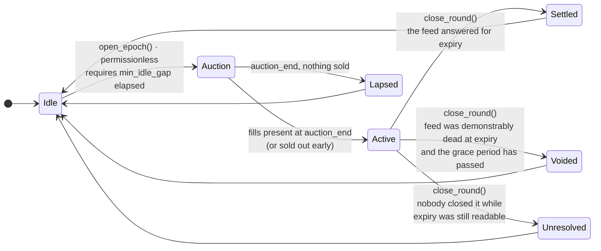

# One round, end to end

The vault has one round in flight at a time. This page is the canonical description of the cycle —
every other page on this site defers to it.

## The state machine



Four terminal outcomes, one shared exit: all of them finalize through the same internal path, so
the withdrawal-queue accounting cannot diverge between them.
[The four ways a round ends](round-outcomes.md) takes each one in turn.

## The clock, at the shipped parameters

Times below are the deployed vault's ([`aXLM-E`](../reference/deployment.md#parameters)).

| Window | How long | What is possible |
|---|---|---|
| Previous round finalized → a new round may open | **2 hours** minimum (`min_idle_gap`) | Deposits mint instantly; withdrawals pay instantly; pending deposits convert |
| `open_epoch()` → `auction_end` | **45 minutes** (`auction_duration`) | Bidding. The premium falls linearly from 280 bps to 55 bps of notional |
| `auction_end` → `expiry` | the rest of **3 days** (`epoch_duration`, measured from the open) | Nothing to do. The option is live |
| `expiry` onwards | until somebody calls | Closing is open to anyone and pays a bounty |

Past expiry there is a second clock, and it is the failure envelope rather than the normal path:

| Moment | Parameter | What it means |
|---|---|---|
| `expiry + 12 h` | `oracle_dead_after` | The earliest a demonstrably dead feed may annul the round |
| `expiry + 20 h 15 m` | the feed's reachable depth | Past this the expiry window can no longer be read by anyone |
| `expiry + 21 h` | `unresolved_after` | The round closes as unresolved **without calling the price feed at all** |

In the normal path a round is closed within minutes of expiry, because closing pays.

## Phase by phase

### Idle: between rounds

No option is live. Deposits mint shares immediately at the current price, withdrawals burn shares
and pay immediately, and a pending deposit from the previous round can be converted.

A new round may open once `min_idle_gap` has elapsed since the last finalization — two hours on the
deployed vault. The gap scales with the round length — `min_idle_gap ≥ epoch_duration ÷ 50` is
enforced at construction **and re-checked on every parameter change**, so no later admin call can
shrink it below that floor — because a fixed hour on a two-week round is not a window.

**Anyone may end the idle window** as soon as it reaches its minimum width. That is a real cost to
a depositor timing an instant exit, and [Getting your money out](../depositor/withdrawing.md)
explains the flag that protects against it.

### `open_epoch()`: permissionless, no signature at all

```rust
fn open_epoch(env: Env) -> bool;
```

It takes **no authorization** — no admin, no signature from any particular party. Anyone can call
it. What it does:

```
spot           = a guarded reading of the price feed, live
strike         = spot × 1.03                      (strike_bps_otm = 300)
expiry         = now + 3 days                     (epoch_duration)
auction_end    = now + 45 minutes                 (auction_duration)
notional_offer = locked_assets                    (everything the vault holds for depositors)
```

It reverts, and anyone may retry, if the feed is stale, if a short window disagrees with a longer
one of the same moment by more than 1 %, if the gap has not elapsed, if the vault has never had a
deposit, or if it holds less than the 100 XLM minimum fill. **No round opens on a price that could
not be read.** [The price feed](price-feed.md) has the full list.

It returns `false` rather than reverting in one case worth knowing about: if the call first
finalized a lapsed auction and *then* hit a failed precondition, the finalization is kept and the
answer is `false`. Reverting there would discard a round that had genuinely ended.

Pause blocks `open_epoch`. It is one of exactly three calls pause blocks, and all three are ways
*in*.

### Auction: 45 minutes

The premium starts high and falls linearly to a floor:

```
premium_bps(t) = start_bps − ⌊(start_bps − floor_bps) × elapsed ÷ auction_duration⌋
               = 280 − ⌊225 × elapsed ÷ 2700⌋            on the deployed vault
```

Bids are signed by the bidder, partial fills are the expected case, and the offer flips to `Active`
the instant it sells out. [How the premium is discovered](auction.md) is the full page.

If nothing sells by `auction_end`, the round is **lapsed**: no premium, no payout, collateral never
moved, share price unchanged. This resolves 45 minutes into the round rather than at the end of
it, so an unsold round frees the collateral the same hour.

### Active: until expiry

Nothing happens on chain and nothing needs to. The collateral is committed; the strike and the
expiry are fixed; the bidders hold what they bought.

Depositors can still queue an exit during this phase — the shares are burned immediately and the
XLM is paid at whatever price the round closes at. Pending deposits stay fully cancellable
throughout, because they were never locked.

### `close_round()`: permissionless, and the caller does not choose the outcome

```rust
fn close_round(env: Env, bounty_to: Address) -> RoundOutcome;
```

**One entry point, no outcome argument.** The contract reads the price feed as it stood *at
expiry*, once, and dispatches on what it finds: the round settles if the feed answered, voids if
the feed was demonstrably dead at expiry and the grace period has passed, and finalizes as
unresolved if expiry has left the feed's reachable history — or, past a validated bound, without
calling the feed at all.

Three separate entry points would let the caller name the result and would leave the exclusion
between them as something a test hopes for. One dispatcher makes it structural. This is invariant
[I10](../trust/invariants.md#i10-closing-a-round-is-a-function-of-history).

Whoever calls it names the address that receives the **bounty** — 25 bps of the round's premium on
the deployed vault, capped at 100 bps by the contract. The bounty exists so that closing never
depends on someone being generous. It is paid when a round settles and when it finalizes
unresolved; a voided round pays none, because a void refunds the premium in full and there is
nothing to pay it from.

`close_round` is **not pausable**, is O(1) on every branch, and never iterates bidders. A per-bidder
loop would make the exit path's cost grow with participation, which is a denial-of-service surface
aimed at the one call that must never fail.

## Who can call what

| Call | Who | Pausable |
|---|---|---|
| `open_epoch` | anyone, no signature | **yes** |
| `bid` | anyone, signed by the bidder — narrowed by an expiring allowlist until 2026-09-07 | **yes** |
| `deposit` | the depositor | **yes** |
| `close_round` | anyone, no signature | no |
| `request_withdraw` · `claim_withdraw` · `cancel_pending_deposit` · `redeem_shares` | the holder | no |
| `claim_payout` · `claim_refund` | the bidder | no |
| `claim_fee` | the fee recipient | no |
| `restore_position` | anyone, for anyone | no |
| every `set_*`, `upgrade`, `migrate` | admin only | n/a |

The keeper is a bot that calls `open_epoch` and `close_round` on a timer. It holds one key, that
key can call two calls anyone can call, and losing it costs the bounties and nothing else. **It is
a convenience, never an authority.**
