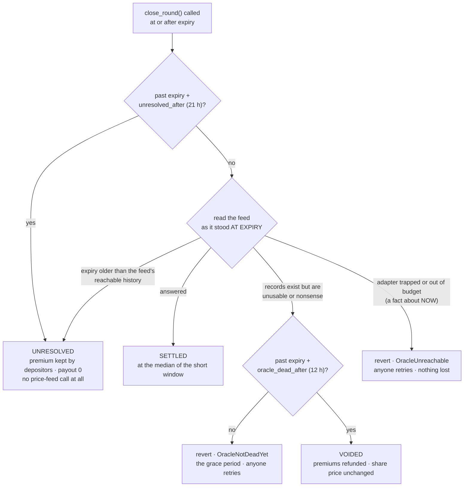

# The four ways a round ends

A round ends **settled**, **lapsed**, **voided** or **unresolved**. None of the four is an error.
Two of them produce no premium and no payout at all, and they are recorded with first-class events
rather than hidden.

The property that matters is not that there are four. It is that **which one you get is a function
of history**, not of who transacted when — invariant
[I10](../trust/invariants.md#i10-closing-a-round-is-a-function-of-history).

## The four, side by side

| Outcome | Reached when | Premium | Payout | Share price | Collateral | Bounty |
|---|---|---|---|---|---|---|
| **Settled** | Expiry reached, the feed answered for that window | kept by depositors | to bidders if `spot > strike` | recomputed | reduced by payout + fee + bounty | paid |
| **Lapsed** | The auction closed with nothing sold | none earned | none | unchanged — carried forward untouched | untouched | none — there is no premium |
| **Voided** | The feed was demonstrably dead **at expiry**, and `expiry + 12 h` has passed | refunded to bidders, exactly | none | unchanged — carried forward untouched | untouched | none |
| **Unresolved** | Nobody closed the round before expiry left the feed's reachable history — or the price adapter could not be called at all, past a validated bound | **kept by depositors** | none | recomputed | reduced by fee + bounty | paid |

All four finalize through the same internal path, so the withdrawal-queue accounting cannot diverge
between them. **All four emit an event carrying `wclaims`** — every outcome credits the withdrawal
queue, and an indexer that only read it on `settled` would drift permanently the first time a round
lapsed with a queued exit.

## How the branch is chosen

**The classification is the whole point.** A fact about the *expiry window* — the feed was dead
then — may annul a round. A fact about *now* — the adapter trapped this ledger — may not.
Conflating the two would let one congested ledger annul a round that was perfectly settleable, and
confiscate a payout the buyer had earned.

Every branch is permissionless. Both reverting cases clear with time, and both are bounded rather
than merely expected to clear: the grace period ends at `expiry + 12 h`, and a transient failure
that never clears ends at `expiry + 21 h`, on the branch that touches no external contract.

## Lapsed: nobody bid

The auction window closed with nothing sold. There is no option, no premium, nothing to settle.
Collateral never moved and the share price is unchanged.

This resolves **45 minutes into the round**, not at the end of it. An unsold round frees the
collateral the same hour rather than a week later. In a thin market this will happen, and it is
honest to expect it: an auction that clears empty is a data point about demand.

## Voided: the feed was unusable at expiry

If the feed had nothing usable for the expiry window, and `expiry + 12 h` has passed, anyone may
annul the round. **Each bidder's premium is returned exactly** — every fill's own `premium_paid`
back, with no pro-rata arithmetic and no rounding loss, unlike the payout, which is pro-rata.
Payout is zero, share price is unchanged, and a loud event is emitted.

The grace period is not waiting for the feed to recover; frozen history does not recover. It is
there so that a transient present-tense failure cannot be recorded as "the feed was dead at expiry".

Voiding pays **no bounty**. A void refunds the premium in full, so the money could only come out of
the refund — breaking the exact-refund promise — or out of collateral, breaking "a void costs
depositors nothing". The bidder is in any case the party motivated to void, since voiding is how
they recover their premium.

The choice to refund rather than settle at the strike is deliberate: an oracle failure is nobody's
fault, and nobody who could cause one should profit from one. Settling at the strike would hand
depositors a free premium; paying out on a stale price would hand bidders a lottery ticket.
Refunding restores both sides to where they started. It does leave an out-of-the-money buyer better
off than settling would have — and a feed's death is not an event any participant can bring about.

## Unresolved: nobody looked in time, or the adapter itself failed

The price feed keeps a bounded history: **255 ticks deep**, and at the feed's live five-minute
resolution that is 76 500 seconds, less the guard window, leaving a reachable anchor for about
**20 hours 15 minutes** past expiry. Past that, the expiry window can no longer be read by anyone,
so the round cannot be decided on evidence. It finalizes **unresolved**: the premium stays with
depositors, the payout is zero, and whoever closed it takes the bounty.

There is a second way into the same outcome, and it exists so no failure can leave collateral in
limbo: **at `expiry + 21 h` the round closes as unresolved without calling the price adapter at
all.** That bound is validated on-chain to sit strictly beyond the feed's reachable history and is
bounded above so no admin setting can push it out of reach, so it returns the outcome a working
adapter could only have returned at that instant. It adds no fifth result and cannot be used to
steer one.

That branch is what makes *"no oracle state can trap funds"* a property of the code rather than a
claim about it. Without it, a permanently unreachable adapter would make `close_round()` revert
forever and the round's collateral would stay `Active` — the exact state this design says is
unreachable.

### Why unresolved keeps the premium rather than refunding it

This is the one rule on the site that is not written in the buyer's favour, and the reasoning is
worth stating rather than burying.

A refund is what an unbounded version of the void path would do, and **it pays the buyer to wait.**
Out of the money, letting the clock run out returns 100 % of the premium — and no bounty funded
out of that same premium can ever be large enough to outbid a full refund. Retaining the premium
makes waiting worth exactly nothing to an out-of-the-money buyer and strictly negative to an
in-the-money one, who forfeits the payout as well.

> **No party who can cause a delay gains by one.**

**One asymmetry survives, and it is not hidden.** Depositors collectively keep more if an
in-the-money round drifts past the deadline. But drift is an absence of action rather than an
action: closing is permissionless, the party holding a payout-sized incentive to prevent it is the
in-the-money buyer, and they have about twenty hours in which to act. Nobody can *bring the drift
about*. If you can show a way to make it happen, that is a vulnerability and we would rather hear
it — [reporting a vulnerability](../reference/security.md) names it in scope explicitly.

### One stated precondition

`unresolved_after` is fixed when the round opens; the feed's reachable depth is read live when it
closes. **If the price feed lengthens its own tick interval mid-round**, the oracle-free fallback
can fire while an anchored read would still have answered, which costs an in-the-money buyer the
payout. The threshold is `(unresolved_after + guard_window) ÷ 255` — at the shipped values a tick of
about **311 seconds**, against the 300 seconds the feed runs today, so a lengthening of roughly
3.5 % is enough.

Opening a round re-checks the live feed, so the exposure is one round rather than open-ended. It is
stated here rather than argued away, and a bidder can remove it entirely by closing the round early.

## What this looks like as a timeline

For a bidder holding an in-the-money position, at the deployed vault's parameters:

| Time past expiry | What is true |
|---|---|
| 0 | Anyone may close. Closing pays 25 bps of the premium. Do it now |
| 0 – 12 h | If the feed is dead at expiry, closing reverts with `OracleNotDeadYet` |
| 12 h – ~20 h 15 m | If the feed was dead at expiry, anyone may void and every bidder is refunded in full |
| ~20 h 15 m | The expiry window leaves the feed's reach. From here the round can only finalize unresolved |
| 21 h | The round closes as unresolved with no price-feed call at all |

The narrow case where this bites through nobody's fault: the feed was genuinely dead at expiry
*and* nobody annulled the round during the roughly eight hours when voiding was available.
`close_round()` is open to you throughout that window.
